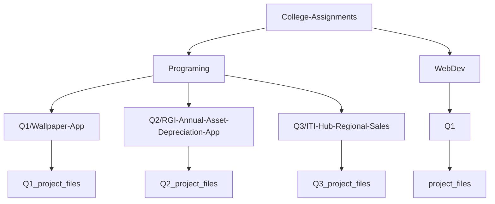

# College-Assignments
> Program/Websites I did during my college career.

#### Folder Structure

## Programing /Q1 /Wallpaper-App

- Type: Desktop App
- Language: Visual Basic
- Cateogory: Utility, Design
> Descr: This app lets the user calculate the amount of wallpaper rolls they'll need to cover a wall of x dimensions with rolls of y dimension. It accepts the length, width, and height of the wall in feet and the coverage of each roll in square feet.

- What I learnt:
	- Using math functions and methods in the math library.
	- Input validation.
	- Solving the problem in Psuedo-code before writing code.

## Programing /Q2 /RGI-Annual-Asset-Depreciation-App

- Type: Desktop App
- Language: Visual Basic
- Cateogory: Business, Analytics
> Descr: This app allows the user to calculate the annual deprecition of their assets over the next 5 years. The output is displayed as Double-Declining Balances and Sum-of-Years Digits.

- What I learnt:
	- Using math functions and methods in the math library.
	- Input validation.
	- Solving the problem in Psuedo-code before writing code.
	- How to manage tabs in memo components for better displaying of information

## ~~Programing /Q3 /ITI-Hub-Regional-Sales~~ _(broke: App.config corrupted missing)_

- Type: Desktop App
- Language: Visual Basic
- Cateogory: Business, Analytics
> Descr: The is app displays the last 6 months of sales from 3 different regions, namely Kwa-Zulu-Natal, Gauteng and Western Cape Province. It adds up and displays the total in sales and the percentage that each region contributed to that total.
It also allows the user to add another month of sales or remove one.

- What I learnt:
	- I went into detail with arrays: how to traverse, add or remove items.
	- Learnt how to manage tabs in memo components for better displaying of information
	
	

## WebDev /Q1

- Type: Website (Wideview)
- Markup: HTML
- Cateogory: Business, Government, Register Form
- Descr:
	> Page 1 (Home Page - Dr Kelly Brown Website.html):

  - The main landing page of a private doctor. Site uses an image, links, header and footer.
    
    
	> **Page 2 (Covid-19 Stats Page - Dr Kelly Brown.html):**
  
  

  - Shares covid-19 stats from the deparment of health in table form.
    
    
	> **Page 3 (Appointment Page - Dr Kelly Brown.html):**
		
    

  - A register form to book an appointment with a docter.

- What I learnt:
	- Basics of HTML and CSS.
	- Representing data in table form.
	- Inserting images and creating links.
